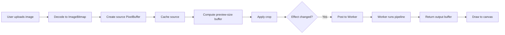
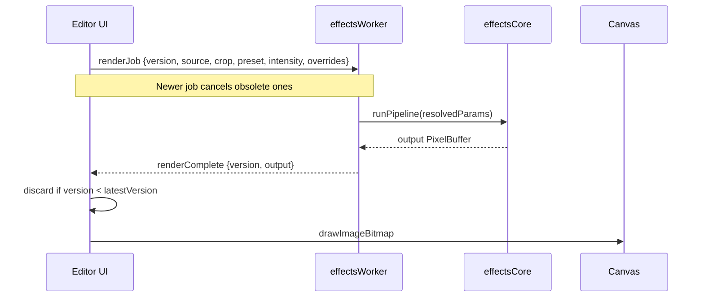
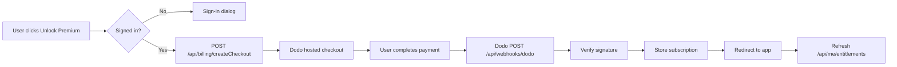

# EffectSoup — Architecture

## Repository Structure

```text
effectLab/
├── apps/
│   └── web/                    # Next.js App Router application
├── packages/
│   ├── effectsCore/            # Pure TypeScript image-processing library
│   ├── effectsPresets/         # Product preset definitions and pipelines
│   └── effectsWorker/          # Browser Web Worker communication layer
├── package.json                # pnpm workspace + Turborepo root
├── turbo.json                  # Turborepo pipeline
├── Features.md
├── todo.md
├── performance.md
└── README.md
```

## Package Boundaries

### `apps/web`

- Next.js App Router, React, TypeScript, Tailwind CSS
- Cohere design system with Space Grotesk / Inter typography
- Custom reusable UI primitives (Button, Card, Badge, Input, Slider, Toast)
- Zustand for local editor UI state
- TanStack Query for server state
- Better Auth, Drizzle ORM, Neon PostgreSQL
- Upstash Redis for rate limiting and cached entitlements
- Cloudflare R2 signed uploads for cloud projects
- Sentry, PostHog

This package owns UI, routing, auth, billing, storage orchestration, and project metadata. It must never contain pixel-processing algorithms. Public routes include `/` (homepage + mini-playground), `/playground` (full editor), `/pricing`, `/docs`, `/account`, `/billing/success`, and `/billing/cancel`.

### Editor UI Components

- `EditableSlider` — reusable slider with double-click numeric editing; used for intensity, advanced range controls, and crop controls. Values clamp to min/max and snap to step.
- `AdvancedControls` — renders per-preset control schema definitions including range, select, boolean, color, and `text` (custom character arrays).

### `packages/effectsCore`

Pure TypeScript library. No framework dependencies. No DOM APIs. Portable raw pixel structure:

```ts
export type PixelBuffer = {
  width: number;
  height: number;
  data: Uint8ClampedArray;
};
```

Contains deterministic image-processing primitives such as resize, grayscale, dither, halftone, ASCII rendering with custom charsets and palettes, grid overlay, glow/bloom, noise, grain, vignette, RGB shift, scanlines, edge detection, and blending.

### `packages/effectsPresets`

Defines product presets and their effect pipelines. Each preset declares:

```ts
type EffectPreset = {
  id: string;
  name: string;
  description: string;
  category: "printGrid" | "asciiSymbols" | "atmosphereGlow";
  access: "free" | "premium";
  defaultIntensity: number;
  intensityMapper: IntensityMapper;
  advancedControlSchema: AdvancedControlDefinition[];
  createPipeline: (resolvedParameters: ResolvedPresetParameters) => EffectPipeline;
};
```

### `packages/effectsWorker`

Handles browser worker communication. Main thread sends image source, crop config, effect config, and `renderVersion`. Worker performs CPU-heavy stages and returns the newest valid output. Implements cooperative cancellation and avoids stale renders painting.

## Browser Rendering Flow



## Worker Communication Flow



## Preview vs Export Modes

| Aspect | Interactive Preview | Final Export |
|--------|---------------------|--------------|
| Trigger | preset/intensity/crop change | Export button |
| Source | preview-size cached buffer | original decoded source |
| Max size | 1400px desktop / 960px mobile | original or up to 4K Premium |
| Quality | approximate while dragging, refined on pause | full quality |
| Location | Web Worker | Web Worker / OffscreenCanvas fallback |

## Auth Flow

- Better Auth manages sessions via `/api/auth/[...all]`.
- Guests use local-only editing.
- Sign-in triggered only by premium actions (export premium, high-res export, save project, advanced controls).
- Account page shows auth methods and sign-out.

## Dodo Billing Flow



Webhook processing is idempotent: duplicate `providerEventId` values are ignored.

## Storage / Cloud Project Flow

- Premium users can save cloud projects.
- Server creates signed R2 upload URLs for source images.
- Project metadata stored in Neon via Drizzle.
- Thumbnails generated client-side and uploaded via signed URL.
- Object keys scoped by `userId/projectId`.
- Ownership enforced on every read/update/delete.

## Entitlement Flow

1. Client requests `/api/me/entitlements`.
2. Server checks subscription table.
3. Result cached in Upstash Redis with short TTL.
4. Client uses cached entitlement for UI gates.
5. Server re-checks entitlement on protected actions.

## Security Boundaries

- `effectsCore` has no network, auth, or UI dependencies.
- All storage credentials stay server-side.
- Environment variables validated with Zod.
- Rate limiting on checkout, upload, project, and webhook routes.
- Webhook signatures verified with raw request body.
- Project operations require ownership checks.
- No secrets in client bundles, logs, or error payloads.

## Scaling Explanation for 1,000 Active Editors

Because every user’s browser performs its own image rendering, there is no shared image-processing bottleneck. The backend only handles:

- Session/entitlement reads (cached in Redis)
- Occasional project metadata writes
- Billing webhook events
- Rate-limited checkout creation

This architecture scales horizontally by adding standard Next.js compute. The image engine scales with each user’s device, protected by adaptive preview quality and worker cancellation.
